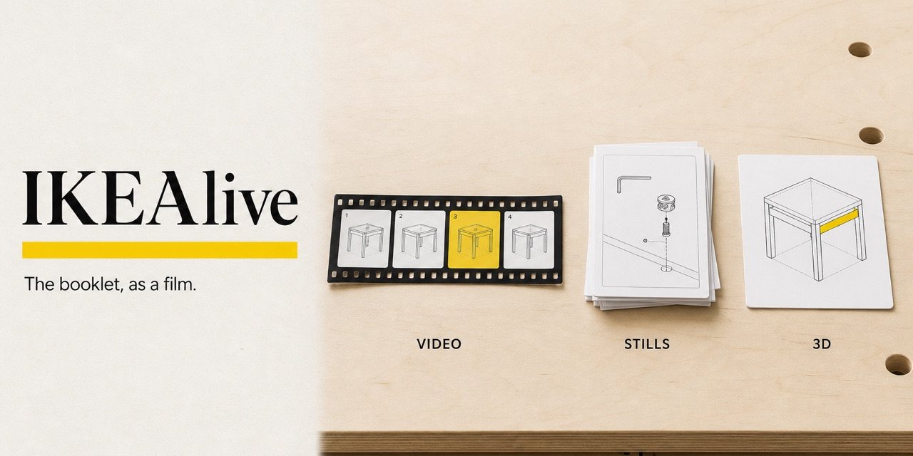
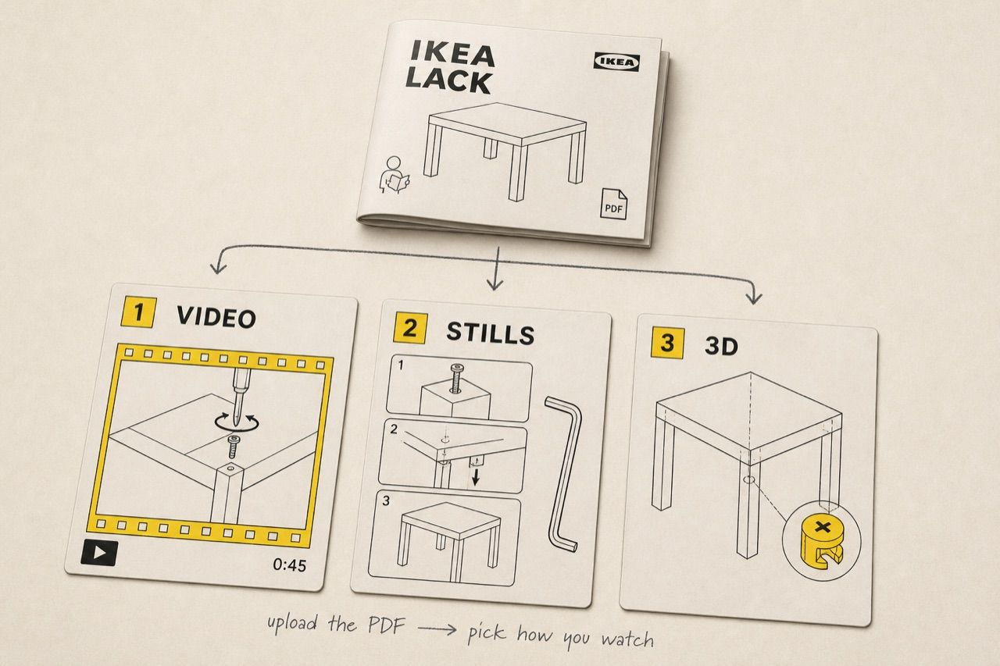

<div align="center">



# IKEAlive

### The booklet, as a film.

Upload an IKEA PDF. Pick **video**, **stills**, or **3D**. Watch the steps.

IKEAFY is the repo. IKEAlive is the workshop.

[](https://nodejs.org)

[Open the workshop](#open-the-workshop) ·
[Three ways to watch](#three-ways-to-watch) ·
[Keys on the bench](#keys-on-the-bench) ·
[Floor plan](#floor-plan)

</div>

<p align="center">
  
</p>

---

## The booklet, as a film

The hex key is already in the bag. What was missing was watching someone do it.

IKEA already drew the plates. IKEAlive does not rewrite them. It reads the PDF (or looks the official booklet up by product name), then you choose a lens:

```
   ①  drop the PDF          ②  pick a lens           ③  watch
  ┌───────────────┐        ┌───────────────┐        ┌───────────────┐
  │  the plates   │   →    │  video        │   →    │  step n       │
  │  (or a name)  │        │  stills       │        │  one at a time│
  └───────────────┘        │  3D           │        └───────────────┘
                           └───────────────┘
```

Type a product name and Tavily can fetch the official IKEA PDF — catalog stand-in without `TAVILY_API_KEY`. Official **LACK** is a secondary locked sheet. The right rail is the kit: inventory, troubles, identify, small parts. Watch chat has a Mic (Web Speech API + `/api/agents/chat`) so spoken commands can start the reel, change step, or request a spare.

## Three ways to watch

Same furniture. Different lens. Pick before you hit **Get the Reel**.

| | What you watch | On the machine |
| --- | --- | --- |
| **Video** | A step film | Needs `FAL_KEY` (fal.ai). |
| **Stills** | Instruction plates, cheaper than a reel | Needs `FAL_KEY`. |
| **3D** | The workshop engine — pieces in space | Local. No fal. |

Leave keys empty and the rest of the app stays local. Video and stills are the ones that leave the machine, and only when `FAL_KEY` is set.

## Open the workshop
A consumer app for assembling IKEA furniture. Upload an instructions PDF, or type a product name so Tavily can fetch the official IKEA PDF (catalog stand-in without `TAVILY_API_KEY`). The studio turns the plates into a Seedance reel you watch one step at a time. Official LACK is a secondary locked sheet. The right rail holds inventory, troubles, identify, and small parts. The yellow circle at the bottom-right opens shop chat, voice, command history, and the scene the shop can see (mode, step, selected piece, room). Watch chat still has a Mic that uses the Web Speech API and `/api/agents/chat` so spoken commands can start the reel, change step, or request a spare.

Requires [Node.js](https://nodejs.org) **20+**. Copy `.env.example` → `.env` if you want keys; leave them blank to stay local. **Do not commit `.env`.**

**Browser**

```bash
cp .env.example .env   # optional — leave keys empty to stay local
npm install
npm run dev
```

- App: `http://localhost:5173`
- API: `http://localhost:8787`

**Electron** — full workshop in a desktop window (IKEAlive upload/watch, Lab Bench, House):

```bash
npm run electron
```

`npm run electron` and `npm run dev:electron` start the same Express + Vite stack as `npm run dev`, then open it in a desktop window. Keep using `npm run dev` if you want the browser instead. After `npm run build`, `electron .` (without `ELECTRON_DEV`) starts Express itself and loads the built client from `http://127.0.0.1:8787`.

## Keys on the bench

Names only. Never paste values. `.env` stays out of git.

| Variable | What it unlocks | Without it |
| --- | --- | --- |
| `FAL_KEY` | Video films and still plates via fal.ai | Those two lenses cannot render remotely |
| `OPENAI_API_KEY` | Lab bench generation (hosted steward) | Built-in local steward |
| `TAVILY_API_KEY` | Official IKEA PDF lookup and live shop links | Catalog stand-ins |

Optional: `PORT` (API, default `8787`), `CLIENT_PORT` (Vite, default `5173`). Model names such as `OPENAI_MODEL_HARD` live in `.env.example`.

## Floor plan

| Path | What lives here |
| --- | --- |
| `client/` | Vite + Three UI (studio, bench, house) |
| `electron/` | Desktop shell that loads the Vite client + Express API |
| `server/` | Express API |
| `electron/` | Desktop wrapper |
| `guides/` | Official building guides |
| `docs/` | Notes, social preview, workshop still |
| `tests/` | Node test suite |

## The other room

Lab is one workspace with three spaces: **Bench** (3D edit), **House** (photo + measurements in the same rails, not a separate product), and **AR** (the `#ar-photo` room-camera overlay). Click **Lab** to open it (IKEAlive modes hide); click **Lab** again to return. IKEAlive (upload / watch) stays the default tab.

## License

No license file is published yet. All rights reserved until one is added.
### Object scans

Lab → **Scan** accepts aligned front, side, and top photos plus a circumference or known length. It segments the photos locally, intersects their silhouettes into a binary voxel visual hull, and polygonizes that hull into a real `THREE.BufferGeometry` body (`scan-mesh`). The dependency-free reconstruction code in `client/src/scan-reconstruct.js` is offered under the **MIT License**; it uses no paid API, uploaded model, or model weights.
